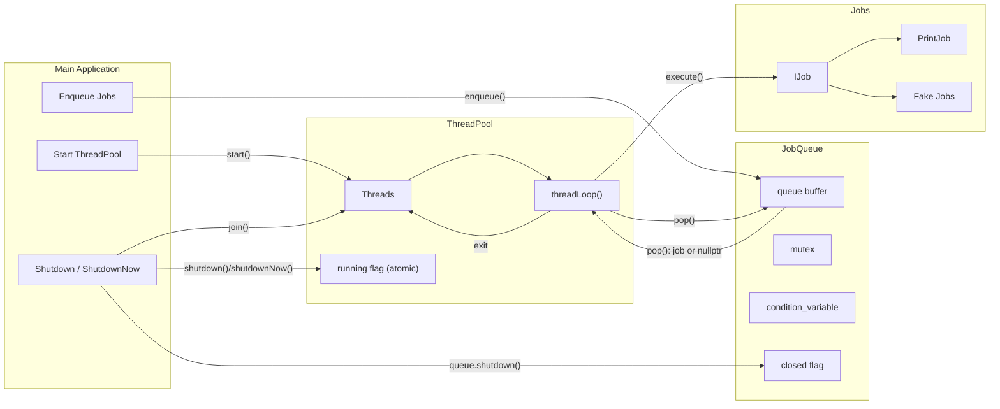
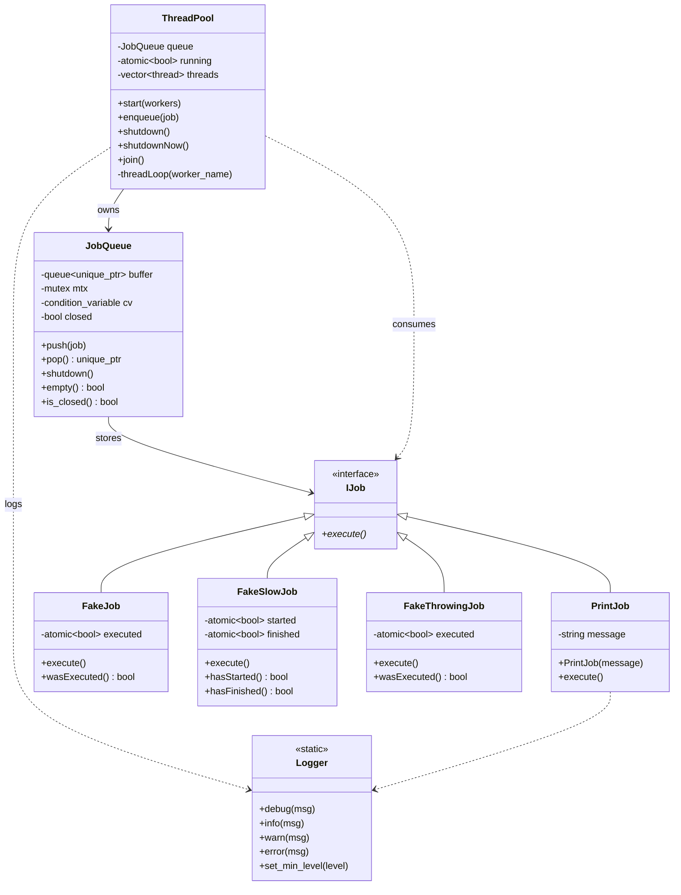

# Task Scheduler


---

## ✨ Core Features

- **Multithreaded Thread Pool**
  - Fixed-size pool created at startup.
  - Each worker thread runs an independent job execution loop.
  - Fully thread-safe job submission via a synchronized job queue.

- **Lock-free style Job Queue (internally synchronized)**
  - Uses `std::mutex` + `std::condition_variable` for safe blocking `pop()`.
  - Supports graceful shutdown and immediate shutdown modes.
  - Ensures no job is lost on normal shutdown.

- **Extensible Job Interface (`IJob`)**
  - Abstract base class representing a unit of work.
  - Enables custom job types such as `PrintJob`, `FakeJob`, `FakeSlowJob`.
  - Easy to extend for real-world tasks (I/O, timers, background tasks…).

- **Graceful and Immediate Shutdown**
  - `shutdown()` → waits for queued work to finish.
  - `shutdownNow()` → wakes all workers and stops immediately (no new jobs accepted).

- **Exception-resistant Worker Loop**
  - Exceptions thrown by job handlers **do not** crash the worker thread.
  - Ensures long-running systems remain stable.

- **Logging System (`Logger`)**
  - Thread-safe global logger.
  - Timestamped and color-coded message formatting.
  - Severity levels: `DEBUG`, `INFO`, `WARN`, `ERROR`.
  - Used across all subsystems for homogeneous diagnostics.

---

## 🌟 Project Highlights

- **Modern CMake Build System**
  - Clear separation between core library, tests, and executable.
  - CMake presets (`debug` / `release`) for consistent multi-platform builds.

- **Extensive Unit Testing (GoogleTest + CTest)**
  - Full coverage of:
    - Job queue behavior (blocking pop, shutdown, sequential operations)
    - Thread pool lifecycle
    - Worker execution, exception handling, shutdown modes
  - Automatically executed in CI pipelines.

- **Cross-Platform Compatibility**
  - Fully validated on:
    - 🪟 Windows 10/11 (MSVC 2022)
    - 🐧 Linux (g++ / clang++)
    - 🐳 Docker containers (Ubuntu 22.04 base image)

- **Continuous Integration with GitHub Actions**
  - Builds both Debug and Release configurations.
  - Runs all unit tests on every commit.
  - Builds and validates a Docker image.
  - Guarantees project reproducibility.

- **Reproducible Development Environments**
  - Docker image provides a clean, isolated environment.
  - Ensures identical results regardless of host OS.

- **Strict Compiler Warnings**
  - `-Wall -Wextra -Wpedantic` (Linux/Clang/GCC)
  - `/W4 /permissive-` (MSVC)
  - Helps catch errors early and maintain code quality.

- **Doxygen-Generated Documentation**
  - Automatic HTML and PDF documentation.
  - Generated via GitHub Actions (docs.yml).
  - Deploys to GitHub Pages for public viewing.

- **C++14-Compliant**
  - No dependency on C++17/20 features.
  - Ensures wider compatibility and avoids needless complexity.

---

## 🏗 Architecture

The following diagram illustrates the internal architecture of the project:



---

## 🗂 Class Diagram



---

## 🛠 Build Instructions

### Windows (Visual Studio 2022)

1. Open Visual Studio 2022.

2. Choose “Open Folder” → select the project root (Task-Scheduler/).

3. Visual Studio automatically detects CMakePresets.json.

4. In the toolbar, select a configuration:

    - debug → includes unit tests (BUILD_TESTING=ON).

    - release → optimized build.

5. Build the project (Ctrl + Shift + B).

6. The executable will be generated at:

```bash
build/<preset>/task_scheduler[.exe]
```

7. Run it directly from Visual Studio or from the command line.

---

### Windows (PowerShell/CLI)
You can also build manually from a terminal with CMake presets:

```powershell
cmake --preset release    # Configure for Release
cmake --build --preset release -j  # Build using Ninja or MSBuild

cmake --preset debug      # Configure for Debug (with tests)
cmake --build --preset debug -j
ctest --preset debug      # Run unit tests
```
---

### Linux / WSL (Debian/Ubuntu based)
Install dependencies:
```bash
sudo apt update
sudo apt install -y build-essential cmake ninja-build git
```
Clone and build:
```bash
git clone https://github.com/sergioguerreroblanco-oss/Task_Scheduler.git
cd Task_Scheduler

cmake --preset release
cmake --build --preset release -j$(nproc)

# Debug build (includes unit tests)
cmake --preset debug
cmake --build --preset debug -j$(nproc)
ctest --preset debug
```
The resulting binary will be located in:
```
build/release/task_scheduler
```

### Docker (fully reproducible environment)
The project includes a Dockerfile that performs a clean build and runs tests automatically:
```bash
docker build -t task_scheduler:local .
docker run --rm task_scheduler:local
```

---

## 🧪 Unit Tests

Unit tests are implemented using GoogleTest and fully integrated into the build system via CTest.
Running a Debug build automatically enables all tests (BUILD_TESTING=ON).

The test suite ensures the correctness and thread-safety of all major components in the project.

### ✅ Covered Scenarios

Below is the list of all behaviors validated by the current test suite:

#### 🧵 ThreadPool

| Test Name                               | Validates                                                                                                  |
| --------------------------------------- | ---------------------------------------------------------------------------------------------------------- |
| **StartsCorrectNumberOfThreads**        | `start(N)` correctly spawns N worker threads.                                                              |
| **EnqueueExecutesAJob**                 | Enqueued job is executed by a worker thread.                                                               |
| **EnqueueExecutesJob**                  | Multiple workers consume tasks correctly.                                                                  |
| **ShutdownCorrectNumberOfThreads**      | `shutdown()` stops all workers and clears thread vector.                                                   |
| **ShutdownNowStopsImmediately**         | `shutdownNow()` stops the pool immediately, skipping queue drain.                                          |
| **WorkerSurvivesExceptionAndContinues** | Exceptions thrown inside jobs do **not** crash the thread — worker continues processing the following job. |

#### 📦 JobQueue

| Test Name                 | Validates                                                            |
| ------------------------- | -------------------------------------------------------------------- |
| **PushPopSequence**       | FIFO push/pop ordering and correctness.                              |
| **BlockPopInOtherThread** | `pop()` blocks correctly and wakes when data is available.           |
| **ShutdownBehaviour**     | `shutdown()` unblocks waiting threads and prevents further blocking. |

#### 💼 Jobs

| Test Name                           | Validates                                      |
| ----------------------------------- | ---------------------------------------------- |
| **PrintJob.ExecutesAndLogsMessage** | `PrintJob::execute()` logs the correct output. |
| **JobInterfaceTest.IsAbstract**     | Ensures `IJob` is a true abstract interface.   |


#### 🧩 Behavioral Guarantees Provided by Tests

The test suite ensures:

✔ ThreadPool is safe
- No thread leaks
- Correct shutdown semantics (shutdown() + shutdownNow())
- Robust to exceptions inside jobs
- No job is silently lost unless shutdownNow() is explicit

✔ JobQueue is safe
- Fully blocking FIFO queue
- Wakes consumers properly
- Graceful exit on shutdown

✔ Jobs execute correctly
- Clear interface (IJob)
- Real jobs (PrintJob)
- Test jobs (FakeJob, FakeThrowingJob, FakeSlowJob)

### Running Tests (Windows)

On Windows, the project has been validated with Visual Studio 2022.
Tests can be executed directly from Test Explorer:
```Menu → Test → Run All Tests```

Alternatively, you can also build and run tests using the provided CMake presets:
```powershell
cmake --preset debug
cmake --build --preset debug
ctest --preset debug --output-on-failure
```
> Note - Need to have installed: 
> 1. [CMake](https://github.com/Kitware/CMake/releases/download/v4.1.1/cmake-4.1.1-windows-x86_64.msi)
> 2. Ninja: 
>```bash 
> winget install Ninja-build.Ninja
>```

### Running Tests (Linux / Docker)

After building the project, run the following command inside the build directory:

```bash
cd build/debug
ctest --output-on-failure
```

This will automatically discover and execute all registered GoogleTest cases.

### Example output:
(example output inside container) 
```
Test project C:/PROJECTS/Task-Scheduler/build/debug
      Start  1: PrintJobTest.ExecutesAndLogsMessage
 1/11 Test  #1: PrintJobTest.ExecutesAndLogsMessage ..................   Passed    0.01 sec
      Start  2: JobInterfaceTest.IsAbstract
 2/11 Test  #2: JobInterfaceTest.IsAbstract ..........................   Passed    0.01 sec
      Start  3: JobQueueTest.PushPopSquence
 3/11 Test  #3: JobQueueTest.PushPopSquence ..........................   Passed    0.01 sec
      Start  4: JobQueueTest.BlockPopInOtherThread
 4/11 Test  #4: JobQueueTest.BlockPopInOtherThread ...................   Passed    0.02 sec
      Start  5: JobQueueTest.ShutdownBehaviour
 5/11 Test  #5: JobQueueTest.ShutdownBehaviour .......................   Passed    0.01 sec
      Start  6: ThreadPoolTest.StartsCorrectNumberOfThreads
 6/11 Test  #6: ThreadPoolTest.StartsCorrectNumberOfThreads ..........   Passed    0.01 sec
      Start  7: ThreadPoolTest.EnqueueExecutesAJob
 7/11 Test  #7: ThreadPoolTest.EnqueueExecutesAJob ...................   Passed    0.08 sec
      Start  8: ThreadPoolTest.EnqueueExecutesJob
 8/11 Test  #8: ThreadPoolTest.EnqueueExecutesJob ....................   Passed    0.03 sec
      Start  9: ThreadPoolTest.ShutdownCorrectNumberOfThreads
 9/11 Test  #9: ThreadPoolTest.ShutdownCorrectNumberOfThreads ........   Passed    0.01 sec
      Start 10: ThreadPoolTest.ShutdownNowStopsImmediately
10/11 Test #10: ThreadPoolTest.ShutdownNowStopsImmediately ...........   Passed    0.21 sec
      Start 11: ThreadPoolTest.threadsurvivesExceptionAndContinues
11/11 Test #11: ThreadPoolTest.threadsurvivesExceptionAndContinues ...   Passed    0.03 sec
100% tests passed, 0 tests failed out of 11
Total Test time (real) =   0.44 sec
```

---

## 🐳 Docker

This project includes a Dockerfile to provide a reproducible build and test environment.

Requires Docker installed and running on your system.

Build image:

```docker build -t task_scheduler:dev .```

Run tests inside container:

```docker run --rm task_scheduler:dev```

Run main binary:

```docker run --rm task_scheduler:dev ./build/release/task_scheduler```

By default, the container builds the project in /app/build/. The binary can be invoked as shown.


---

## 🔄 Continuous Integration

This project provides two GitHub Actions workflows under .github/workflows/:

### ci.yml
This workflow performs the following steps:
- Builds the project on ubuntu-latest using CMake + Ninja and g++.
- Runs all unit tests using CTest (with detailed failure output).
- Builds the Docker image and verifies that it executes correctly inside a container.

✅ Ensures that:
- The codebase compiles cleanly on a fresh Linux environment.
- All unit tests pass consistently.
- The Docker image remains functional and up-to-date.

### docs.yml

This workflow automates documentation generation:
- Installs Doxygen, Graphviz, and LaTeX.
- Generates both HTML and PDF documentation.
- Uploads the generated artifacts for download directly from the workflow summary.
- Deploys HTML docs to GitHub Pages when pushing to the main branch.

✅ Ensures that:
- Documentation is always in sync with the current source code.
- Both HTML and PDF outputs are built automatically.
- Public docs can be viewed directly from the project’s GitHub Pages site.

---

## 📂 Project Structure

```
Task-Scheduler/
├── .github/
│   └── workflows/
│       ├── ci.yml                 # CI pipeline: build + tests + Docker
│       └── docs.yml               # Auto-generate Doxygen docs (HTML + PDF)
│
├── docs/
│   ├── Doxyfile                   # Doxygen configuration
│   └── README.md                  # Additional documentation notes
│
├── include/                       # Public headers (library interface)
│   ├── i_job.h                    # Abstract job interface
│   ├── job_queue.h                # Thread-safe queue of jobs
│   ├── logger.h                   # Thread-safe logging utility
│   ├── print_job.h                # Example job implementation
│   └── thread_pool.h              # Thread pool interface & declarations
│
├── scripts/                       # Automation scripts
│   ├── build.ps1                  # Windows build helper (PowerShell)
│   ├── build.sh                   # Linux build helper
│   ├── generate_docs.ps1          # Windows Doxygen generator
│   └── generate_docs.sh           # Linux Doxygen generator
│
├── src/                           # Private implementation files
│   ├── job_queue.cpp              # JobQueue implementation
│   ├── logger.cpp                 # Logger implementation
│   ├── main.cpp                   # Application entry point
│   ├── print_job.cpp              # PrintJob implementation
│   └── thread_pool.cpp            # ThreadPool implementation
│
├── tests/                         # GoogleTest unit tests
│   ├── fake_job.h                 # Fake job for basic testing
│   ├── fake_slow_job.h            # Slow job used for shutdown tests
│   ├── fake_throwing_job.h        # Job that throws exceptions
│   ├── test_jobs.cpp              # Tests for job behavior
│   ├── test_job_queue.cpp         # Tests for JobQueue
│   ├── test_main.cpp              # Tests related to main / app behavior
│   └── test_thread_pool.cpp       # Tests for ThreadPool
│
├── .clang-format                  # Code style configuration
├── .dockerignore                  # Ignore files in Docker context
├── .gitattributes                 # Git attribute configuration
├── .gitignore                     # Files ignored by Git
│
├── CMakeLists.txt                 # Root CMake build file
├── CMakePresets.json              # Presets for build/debug/release/CI
├── Dockerfile                     # Reproducible CI/Docker environment
└── README.md                      # Project documentation
```

---

## 📖 Documentation

This project uses [Doxygen](https://www.doxygen.nl/) to generate API documentation
from source code comments.

### Generate documentation

#### Windows (PowerShell)
```powershell
Set-ExecutionPolicy -Scope Process -ExecutionPolicy Bypass
.\scripts\generate_docs.ps1
```
Generates HTML (docs/html/index.html) and LaTeX sources (docs/latex/).

PDF (refman.pdf) is not generated on Windows unless you install a full LaTeX toolchain (MiKTeX/TeX Live + make).

#### Linux / WSL (Debian/Ubuntu based)
```bash
sudo apt update
sudo apt install -y doxygen graphviz texlive-latex-base texlive-fonts-recommended texlive-latex-extra make
chmod +x scripts/generate_docs.sh
./scripts/generate_docs.sh
```
Generates HTML (docs/html/index.html) and PDF (docs/latex/refman.pdf).

Open in your browser:
```bash
docs/html/index.html
```

For more details, see docs/README.md

---

## 🎨 Code Style (clang-format)

This project uses **clang-format** to enforce a consistent C++ code style.  
The formatting rules are defined in [`.clang-format`](./.clang-format). 

### 🔧 Chosen Style

The configuration is based on Google C++ Style, with a few modifications to improve readability for embedded and multithreaded systems:

| Setting                                 | Value               | Description                                                                      |
| --------------------------------------- | ------------------- | -------------------------------------------------------------------------------- |
| **BasedOnStyle**                        | `Google`            | Provides a solid, modern baseline for C++ formatting.                            |
| **Language**                            | `Cpp`               | Ensures C++-specific syntax rules (not generic C).                               |
| **IndentWidth / TabWidth**              | `4`                 | Uses 4 spaces per indent (vs Google’s default 2) for improved block readability. |
| **UseTab**                              | `Never`             | Enforces spaces only (consistent across editors).                                |
| **ColumnLimit**                         | `100`               | Balances readability and long template expressions.                              |
| **BreakBeforeBraces**                   | `Allman`            | Places braces on their own line, improving visual structure in nested code.      |
| **AllowShortIfStatementsOnASingleLine** | `false`             | Forces explicit line breaks for clarity.                                         |
| **AllowShortLoopsOnASingleLine**        | `false`             | Prevents compact loop bodies from being overlooked.                              |
| **AllowShortFunctionsOnASingleLine**    | `Inline`            | Allows concise inline functions on a single line only.                           |
| **PointerAlignment**                    | `Left`              | Keeps `T* ptr` instead of `T *ptr` — cleaner and more conventional in C++.       |
| **DerivePointerAlignment**              | `false`             | Disables automatic guessing; enforces explicit `PointerAlignment`.               |
| **SpaceBeforeParens**                   | `ControlStatements` | Adds a space in `if (` / `while (` for readability, not for calls.               |
| **SortIncludes**                        | `true`              | Automatically organizes include directives alphabetically.                       |
| **IncludeBlocks**                       | `Regroup`           | Groups and reorders includes logically within the file.                          |
| **AlignConsecutiveAssignments**         | `true`              | Improves alignment of variable assignments.                                      |
| **AlignConsecutiveDeclarations**        | `true`              | Aligns consecutive variable declarations.                                        |
| **AlignOperands**                       | `true`              | Keeps arithmetic/logical expressions neatly aligned.                             |
| **CommentPragmas**                      | `'^!'`              | Allows pragma-specific comment formatting.                                       |
| **FixNamespaceComments**                | `true`              | Automatically adds trailing `// namespace X` comments when closing.              |
| **SpacesBeforeTrailingComments**        | `2`                 | Keeps a consistent gap before end-of-line comments.                              |
| **KeepEmptyLinesAtTheStartOfBlocks**    | `false`             | Avoids unnecessary blank lines at block starts.                                  |

---

### Windows (Visual Studio Code / PowerShell)

1. Install LLVM (includes clang-format):

    - Download the LLVM installer for Windows (`https://github.com/llvm/llvm-project/releases`)
    
    - During setup, check “Add LLVM to the system PATH”.

2. Verify installation:

```PowerShell
clang-format --version
```
3. Format all project files:
```PowerShell
clang-format -i include\*.h include\*.ipp src\*.cpp tests\*.cpp
```
### Linux / WSL (Debian/Ubuntu based)

1. Install clang-format:
```bash
sudo apt update
sudo apt install -y clang-format
```
2. Verify installation:
```bash
clang-format --version
```
3. Format all project files:
```bash
clang-format -i include/*.h include/*.ipp src/*.cpp tests/*.cpp
```

---

## 📌 Notes

- **C++ Standard**: The project uses **C++14**, configured via ```set(CMAKE_CXX_STANDARD 14)``` ensuring maximum compatibility with embedded systems, legacy compilers, and cross-platform builds.
    
- **Logging**:

    A fully centralized, thread-safe Logger utility is used throughout the project.
    It provides:
    - Atomic writes to avoid interleaved logs
    - Timestamps with millisecond precision
    - Configurable severity levels (DEBUG, INFO, WARN, ERROR)
    - Uniform log formatting across all components (ThreadPool, JobQueue, Jobs, main application)

- **Thread Safety**:

    Core concurrency structures (ThreadPool, JobQueue) use:
    - std::mutex
    - std::condition_variable
    - std::atomic<bool> 
    
    ensuring correct synchronization across multiple worker threads without data races.

- **Cross-Platform Compatibility**:

    Successfully builds and runs on:

        - 🪟 Windows (MSVC 2022)
        - 🐧 Linux (g++)
        - 🐳 Docker container environments

        Each environment uses consistent CMake presets to simplify builds and CI/CD automation.

- **Reproducibility**:

    Thanks to Docker + CI:
    - Every build uses the same compiler version and toolchain.
    - Unit tests run automatically inside a clean container.
    - Documentation is generated predictably using Doxygen + Graphviz.

---

## ❤️ Acknowledgements

his project was originally developed as part of a technical assessment and was later expanded into a full professional-grade implementation demonstrating:

- **Clean architecture** with clear responsibility boundaries (ThreadPool, JobQueue, Jobs, Logger).
- **Robust multithreading design** using condition variables, atomics, and safe shutdown semantics.
- **Thread-safe data structures** and exception-resilient worker loops.
- **Comprehensive unit testing** using GoogleTest + CTest, covering all core scenarios.
- **Automated documentation** using Doxygen, Graphviz, and optional LaTeX PDF generation.
- **Modern CI/CD pipelines** with GitHub Actions validating build, tests, Docker reproducibility, and documentation.
- **Cross-platform tooling**, building cleanly on Windows, Linux, and inside containerized environments.

Special thanks to the open-source community behind:
- CMake  
- GoogleTest  
- Doxygen  
- Graphviz  
- LLVM / clang-format  
- The GitHub Actions ecosystem  

Their tools made this project reliable, maintainable, and fully reproducible.